# DREID-Forge Architecture

This document provides a comprehensive guide to the internal design, data flow, and algorithms of the `dreid-forge` library. It is intended for contributors, integrators, and users who wish to understand the technical details behind automated DREIDING force field parameterization.

## 1. System Overview

DREID-Forge is architected as a **multi-stage transformation pipeline** that converts raw molecular geometry into simulation-ready force field parameters. The system integrates four external crates (`bio-forge`, `dreid-typer`, `cheq`, `ffcharge`) and orchestrates them through a unified API.

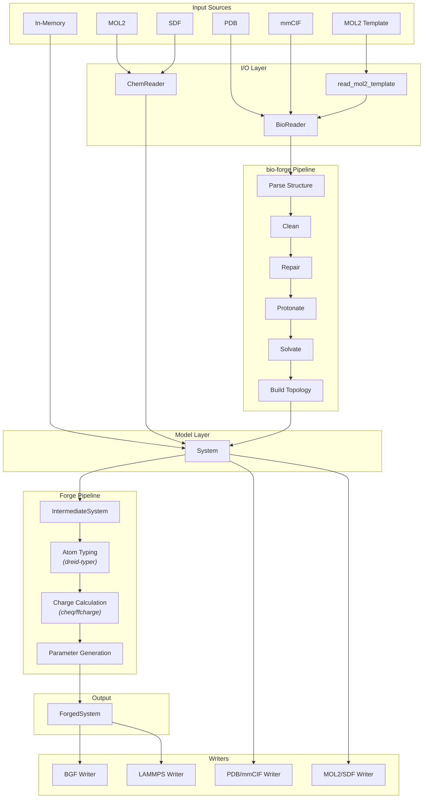

### Core Components

| Component           | Description                                                                                                     |
| ------------------- | --------------------------------------------------------------------------------------------------------------- |
| **I/O Layer**       | Readers and writers for molecular structure file formats                                                        |
| **Model Layer**     | Neutral data structures (`System`, `Atom`, `Bond`, `BioMetadata`)                                               |
| **Forge Pipeline**  | The parameterization engine: typing → charging → parameter generation                                           |
| **External Crates** | `bio-forge` (structure prep), `dreid-typer` (atom typing), `cheq` (QEq charges), `ffcharge` (classical charges) |

---

## 2. I/O Layer Architecture

The I/O layer provides a dual-track system for reading molecular structures: **ChemReader** for small molecules and **BioReader** for biomolecules with full preparation capabilities.

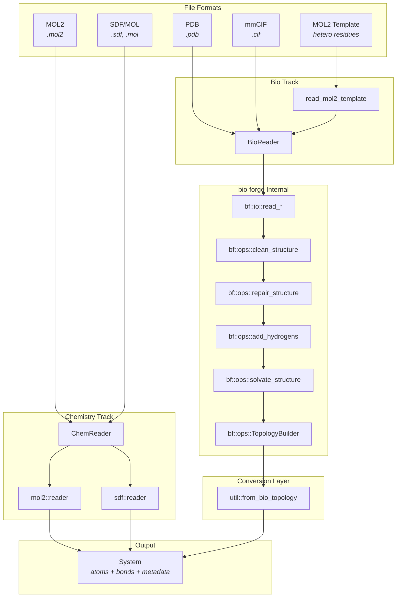

### 2.1 ChemReader: Direct Small-Molecule Parsing

`ChemReader` provides lightweight parsing for chemistry-focused formats without biological context:

- **MOL2 Reader** — Parses `@<TRIPOS>MOLECULE`, `@<TRIPOS>ATOM`, and `@<TRIPOS>BOND` sections. Element inference uses atom type strings with fallback to atom names.
- **SDF Reader** — Parses MDL V2000 connection tables with fixed-width atom blocks and bond blocks. V3000 format is explicitly unsupported.

Both readers produce a `System` with `atoms`, `bonds`, and no biological metadata.

### 2.2 BioReader: Biomolecular Preparation Pipeline

`BioReader` wraps the `bio-forge` crate to provide a complete biomolecular preparation workflow:

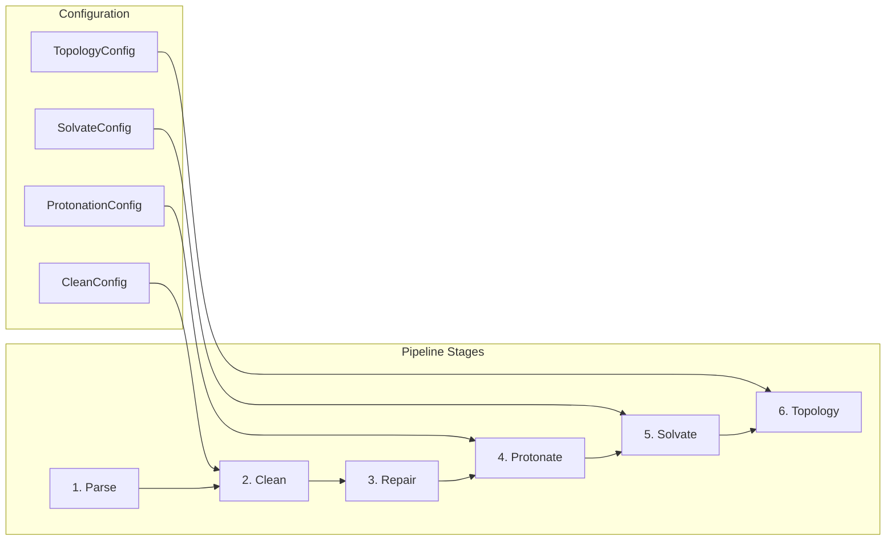

| Stage     | bio-forge Function                                    | Purpose                                                |
| --------- | ----------------------------------------------------- | ------------------------------------------------------ |
| Parse     | `io::read_pdb_structure` / `io::read_mmcif_structure` | Raw structure ingestion with alias resolution          |
| Clean     | `ops::clean_structure`                                | Remove water, ions, hydrogens, or specific residues    |
| Repair    | `ops::repair_structure`                               | Reconstruct missing heavy atoms via template alignment |
| Protonate | `ops::add_hydrogens`                                  | Add hydrogens with pH-aware protonation states         |
| Solvate   | `ops::solvate_structure`                              | Add water box and counterions                          |
| Topology  | `ops::TopologyBuilder`                                | Build covalent bonds from residue templates            |

### 2.3 Writers: Output Format Support

| Writer         | Function                       | Input                       | Output                         |
| -------------- | ------------------------------ | --------------------------- | ------------------------------ |
| **ChemWriter** | `mol2::writer`, `sdf::writer`  | `System`                    | Chemical formats               |
| **BioWriter**  | `pdb::writer`, `mmcif::writer` | `System` with `BioMetadata` | Biological formats             |
| **BGF**        | `write_bgf`                    | `ForgedSystem`              | Biograf format with atom types |
| **LAMMPS**     | `write_lammps_package`         | `ForgedSystem`              | Data + settings files          |

### 2.4 Data Model Conversion

The `io::util` module provides bidirectional conversion between `dreid-forge` and `bio-forge` data models:

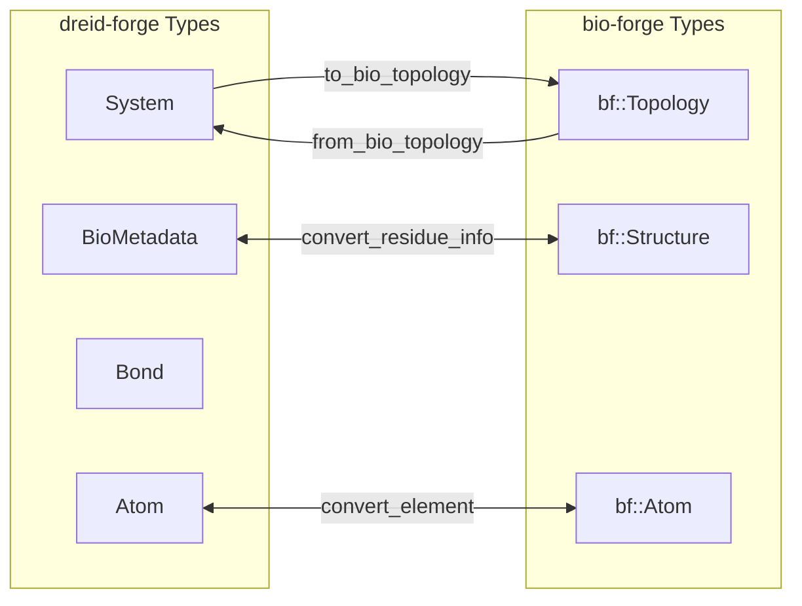

---

## 3. Forge Pipeline

The `forge()` function is the central entry point that orchestrates the complete parameterization workflow. It transforms a `System` into a `ForgedSystem` through four sequential stages.

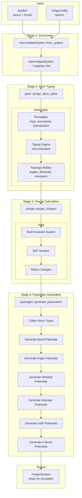

### 3.1 Stage 1: System Conversion

`IntermediateSystem::from_system` prepares the molecular data for parameterization:

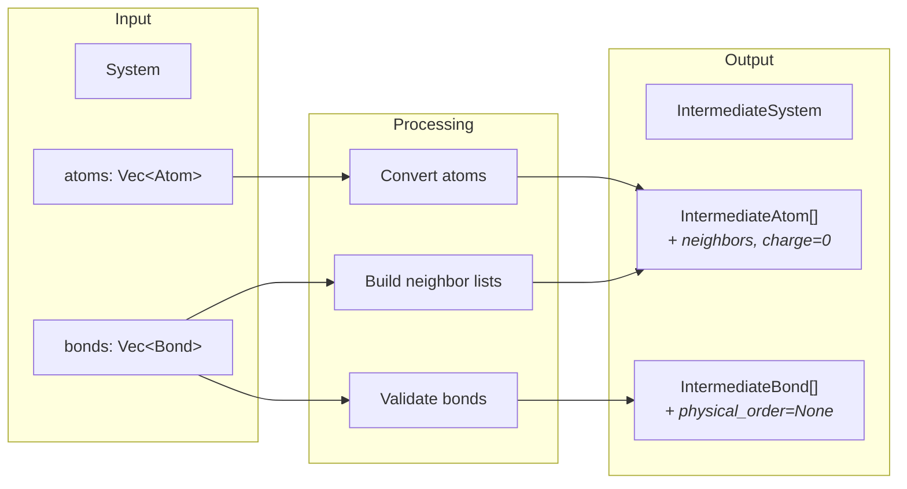

**Key operations:**

- Validates all bond indices are within bounds
- Builds bidirectional neighbor lists for each atom
- Initializes empty atom types and zero charges
- Returns `Error::EmptySystem` for empty input

### 3.2 Stage 2: Atom Typing via dreid-typer

The typing stage delegates to `dreid-typer` for DREIDING atom type assignment:

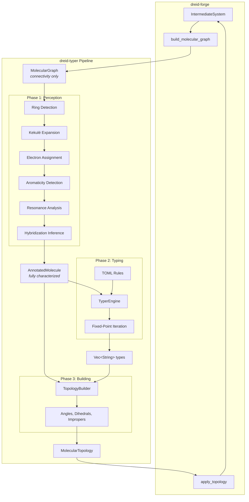

**Perception passes (in order):**

| Pass             | Module                      | Output                             |
| ---------------- | --------------------------- | ---------------------------------- |
| 1. Rings         | `perception::rings`         | `is_in_ring`, `smallest_ring_size` |
| 2. Kekulization  | `perception::kekulize`      | Explicit bond orders               |
| 3. Electrons     | `perception::electrons`     | `formal_charge`, `lone_pairs`      |
| 4. Aromaticity   | `perception::aromaticity`   | `is_aromatic`, `is_anti_aromatic`  |
| 5. Resonance     | `perception::resonance`     | `is_resonant`                      |
| 6. Hybridization | `perception::hybridization` | `hybridization`, `steric_number`   |

**Typing engine:**

- Evaluates TOML rules sorted by priority (descending)
- Uses fixed-point iteration for `neighbor_types` dependencies
- Converges when no atom's type changes between rounds

**Applied results:**

- `IntermediateAtom.atom_type` ← assigned type string (e.g., `"C_3"`, `"O_R"`)
- `IntermediateAtom.hybridization` ← `Hybridization` enum
- `IntermediateBond.physical_order` ← `PhysicalBondOrder` (Single/Double/Triple/Resonant)
- `IntermediateSystem.angles` ← enumerated angle terms
- `IntermediateSystem.dihedrals` ← enumerated proper dihedral terms
- `IntermediateSystem.impropers` ← enumerated improper dihedral terms

### 3.3 Stage 3: Charge Calculation

The charge module supports three methods: **None** (zero charges), **QEq** (global charge equilibration), and **Hybrid** (classical force field charges for biomolecules + QEq for ligands).

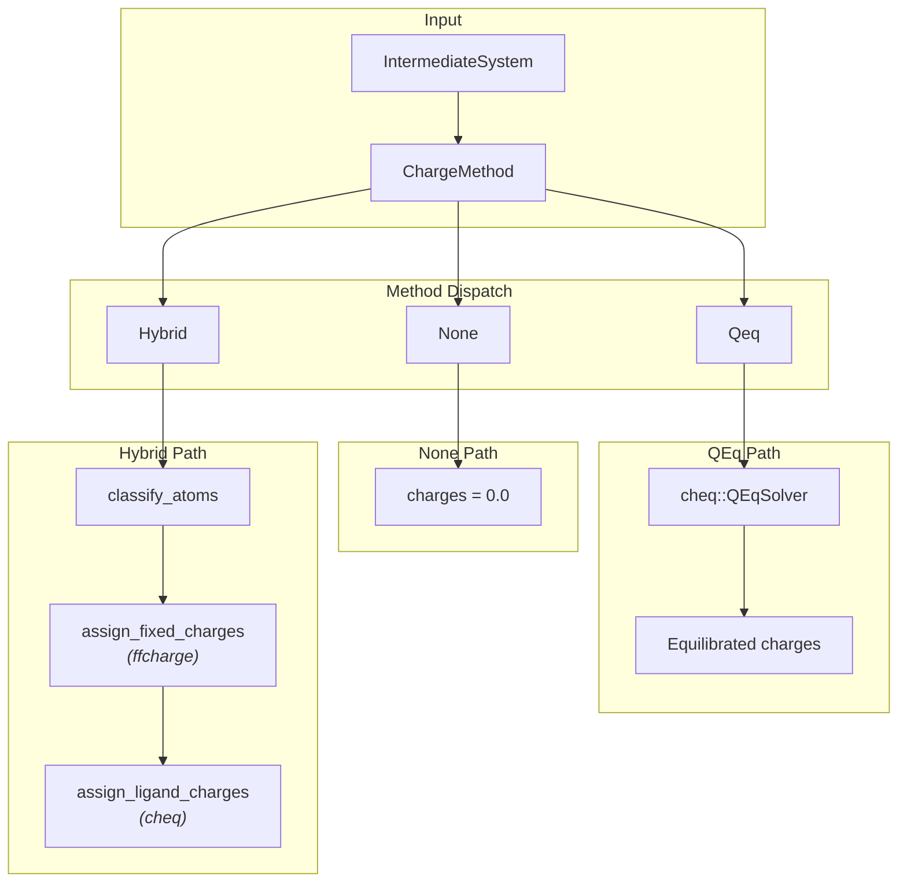

#### 3.3.1 Global QEq Method

When `ChargeMethod::Qeq` is configured, partial charges are computed using the `cheq` crate:

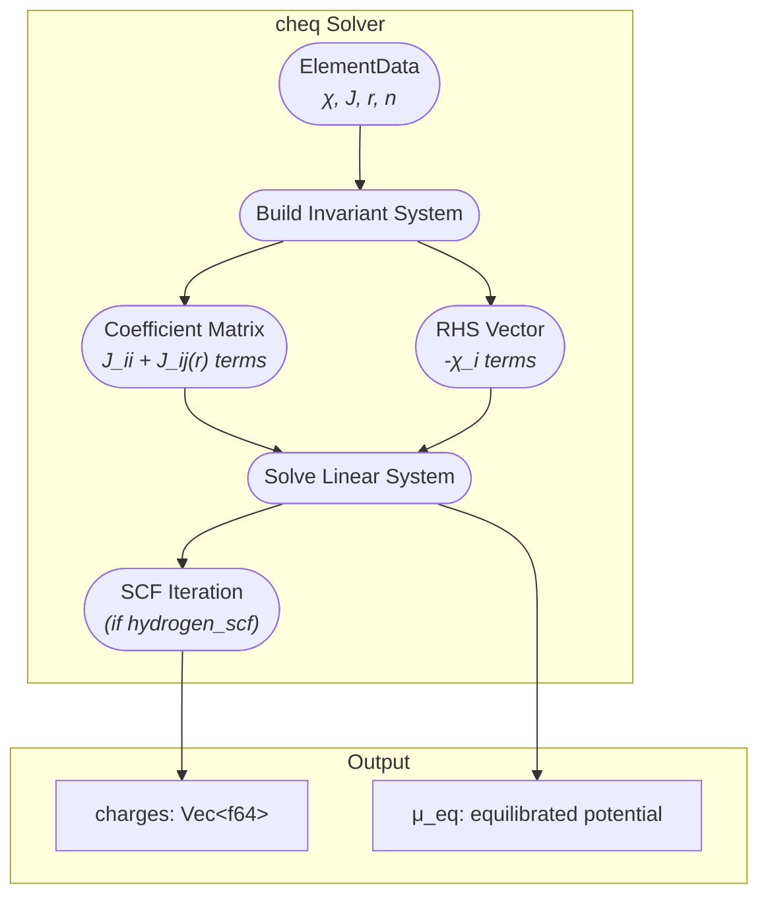

**QEq algorithm summary:**

1. **Build system:** Construct matrix $A$ and vector $b$ where:

   - Diagonal: $A_{ii} = J_i$ (atomic hardness)
   - Off-diagonal: $A_{ij} = J_{ij}(r_{ij})$ (screened Coulomb)
   - Constraint row: charge conservation

2. **Solve:** $A (q, \mu)^T = b$ yields charges and chemical potential

3. **Iterate:** If hydrogen SCF is enabled, update hydrogen hardness based on charge and re-solve

#### 3.3.2 Hybrid Charge Method

The hybrid method combines classical force field charges for biomolecules with QEq for ligands. This requires biological metadata (`BioMetadata`) to classify atoms.

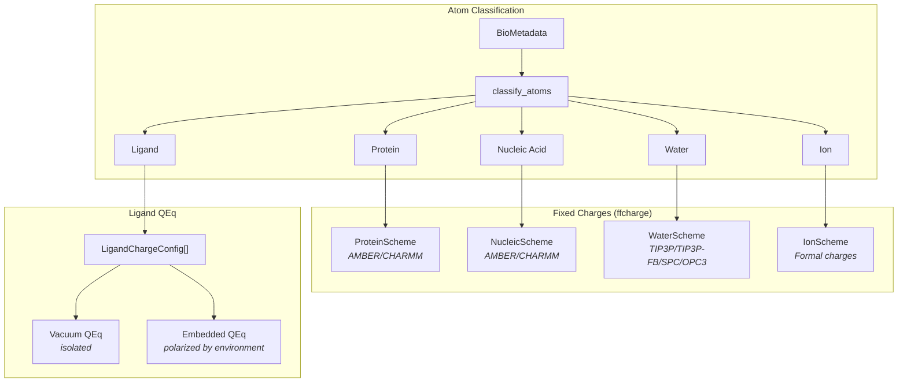

**Atom classification rules:**

| Category     | Source                                    | Charge Source             |
| ------------ | ----------------------------------------- | ------------------------- |
| Protein      | `StandardResidue::ALA..VAL`               | `ffcharge::ProteinScheme` |
| Nucleic Acid | `StandardResidue::A..DI`                  | `ffcharge::NucleicScheme` |
| Water        | `StandardResidue::HOH`                    | `ffcharge::WaterScheme`   |
| Ion          | `ResidueCategory::Ion`                    | `ffcharge::IonScheme`     |
| Ligand       | `ResidueCategory::Hetero` or unrecognized | QEq (vacuum or embedded)  |

**pH-aware terminal handling:**

Terminal protonation states are determined by comparing `BioMetadata.target_ph` with pKa values:

| Terminal   | pKa | Low pH            | High pH             |
| ---------- | --- | ----------------- | ------------------- |
| N-terminal | 8.0 | NH₃⁺ (protonated) | NH₂ (neutral)       |
| C-terminal | 3.1 | COOH (protonated) | COO⁻ (deprotonated) |

#### 3.3.3 Embedded QEq for Ligands

Embedded QEq polarizes the ligand's charge distribution based on the electrostatic potential from surrounding fixed-charge atoms (proteins, nucleic acids).

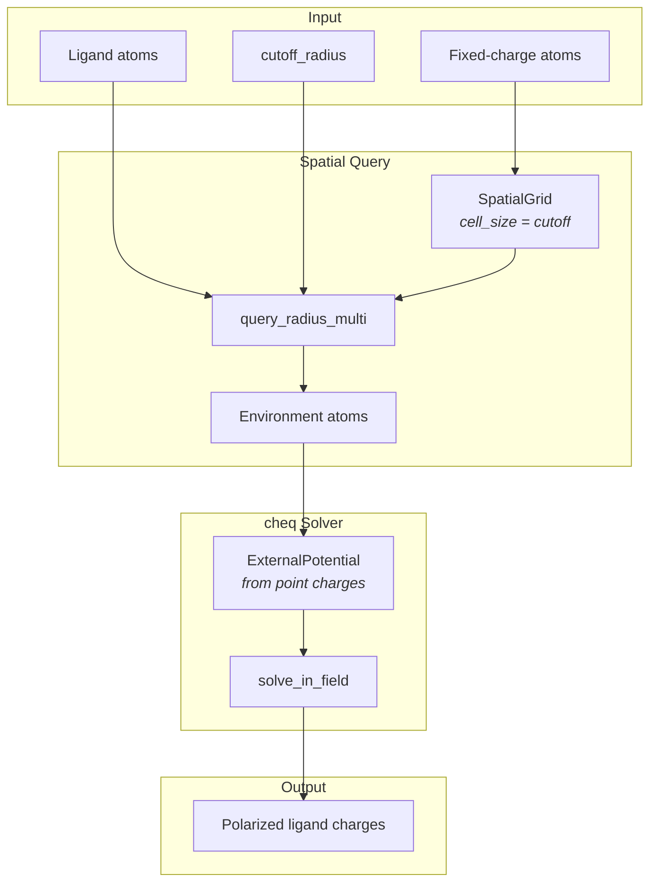

**Spatial grid optimization:**

The `SpatialGrid` data structure provides O(1) amortized neighbor lookups:

- Space is divided into cubic cells of size equal to the cutoff radius
- Each cell stores indices of atoms within its bounds
- Range queries check the 27 neighboring cells (3×3×3 cube)
- Multi-point queries (`query_radius_multi`) efficiently find all atoms within range of any ligand atom

**Why fixed charges only as environment:**

Only atoms with pre-assigned fixed charges (proteins, nucleic acids, water, ions) are included in the external potential. Including other ligands would create mutual dependencies requiring self-consistent iteration, adding complexity without significant accuracy improvement for typical drug-protein systems

### 3.4 Stage 4: Parameter Generation

The final stage generates all force field parameters from the typed and charged system:

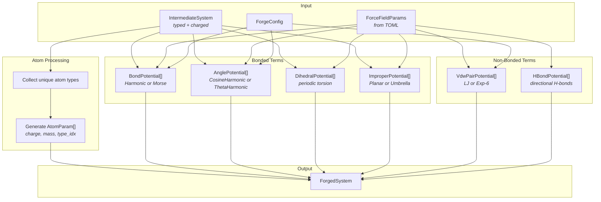

---

## 4. Data Structures Reference

### 4.1 Input Types

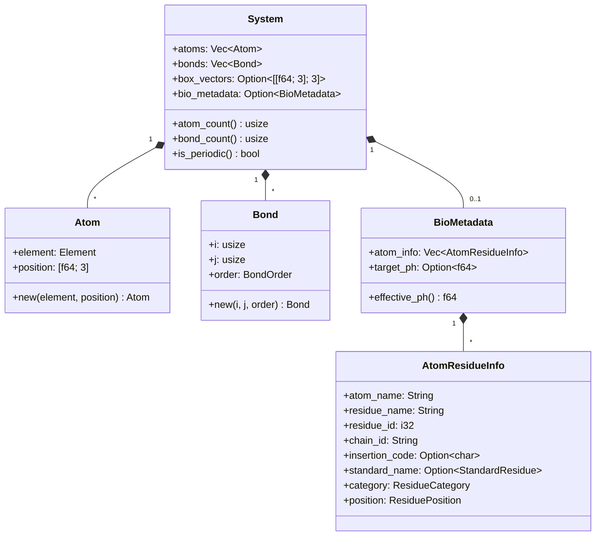

### 4.2 Output Types

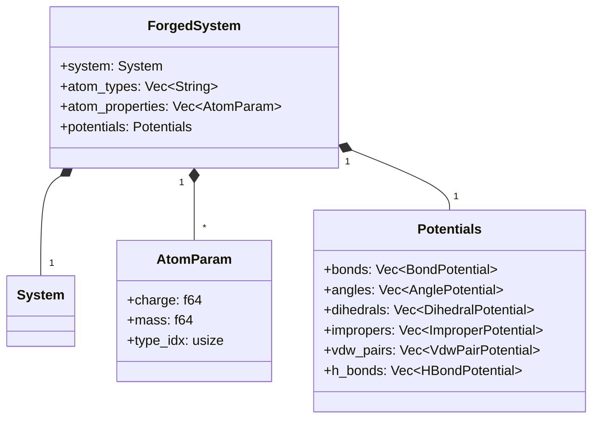

### 4.3 Potential Types

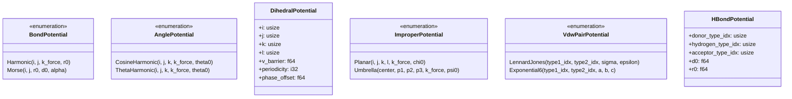

---

## 5. Algorithm Deep Dives

### 5.1 DREIDING Atom Typing Rules

The typing engine uses a priority-based rule system. Key atom types:

| Atom Type | Description        | Hybridization   | Priority |
| --------- | ------------------ | --------------- | -------- |
| `C_3`     | sp³ carbon         | SP3             | 100      |
| `C_2`     | sp² carbon         | SP2             | 200      |
| `C_R`     | Resonant carbon    | Resonant        | 400      |
| `C_1`     | sp carbon          | SP              | 300      |
| `N_3`     | sp³ nitrogen       | SP3             | 100      |
| `N_R`     | Resonant nitrogen  | Resonant        | 400      |
| `O_3`     | sp³ oxygen         | SP3             | 100      |
| `O_2`     | sp² oxygen         | SP2             | 200      |
| `O_R`     | Resonant oxygen    | Resonant        | 400      |
| `H_`      | Generic hydrogen   | —               | 1        |
| `H_HB`    | H-bonding hydrogen | neighbor O or N | 78-80    |

**Fixed-point iteration:**

```pseudo
atom_states[*] = (None, 0)

repeat:
    changed = false
    for each atom i:
        for each rule r (sorted by priority desc):
            if matches(r.conditions, atom[i], atom_states):
                if r.priority > atom_states[i].priority:
                    atom_states[i] = (r.type, r.priority)
                    changed = true
                break
until not changed or rounds > 100
```

### 5.2 QEq Charge Equilibration

The QEq method solves for partial charges that equalize the chemical potential:

**Electronegativity equalization principle:**
$$\chi_i + J_i q_i + \sum_{j \neq i} J_{ij}(r_{ij}) q_j = \mu \quad \forall i$$

**Screened Coulomb interaction:**
$$J_{ij}(r_{ij}) = \frac{14.4}{\sqrt{r_{ij}^2 + \frac{1}{\lambda^2}(r_i r_j)^{n_i + n_j}}}$$

### 5.3 Bond Potential Calculation

**Equilibrium bond length:**
$$r_0 = R_i + R_j - \delta$$

where $R_i$, $R_j$ are covalent radii and $\delta = 0.01$ Å.

**Force constant scaling by bond order:**

| Bond Order | Multiplier |
| ---------- | ---------- |
| Single     | 1.0        |
| Resonant   | 1.5        |
| Double     | 2.0        |
| Triple     | 3.0        |

**Harmonic potential:**
$$V_{bond}(r) = \frac{1}{2} k_b \cdot n \cdot (r - r_0)^2$$

**Morse potential:**
$$V_{bond}(r) = D_0 \cdot n \cdot \left[1 - e^{-\alpha(r - r_0)}\right]^2$$

where $\alpha = \sqrt{k_b / (2 D_0)}$.

### 5.4 Torsion Parameter Rules

Dihedral parameters depend on the hybridization of the central bond atoms:

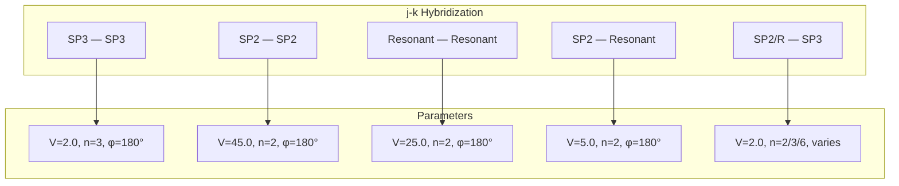

**Special case:** When both central atoms are in the oxygen column (O, S, Se, Te), SP3-SP3 torsions use $n=2$, $\phi=90°$.

### 5.5 Van der Waals Mixing Rules

**Lennard-Jones 12-6:**
$$\sigma_{ij} = \frac{\sigma_i + \sigma_j}{2}$$
$$\epsilon_{ij} = \sqrt{\epsilon_i \cdot \epsilon_j}$$

**Exponential-6:**
$$A_{ij} = \sqrt{A_i \cdot A_j}$$
$$B_{ij} = \frac{B_i + B_j}{2}$$
$$C_{ij} = \sqrt{C_i \cdot C_j}$$

### 5.6 Hydrogen Bond Detection

H-bond potentials are generated when:

1. Hydrogen has type `H_HB` (bonded to O or N)
2. An acceptor atom element is O, N, F
3. The acceptor is not the hydrogen's bonded atom

---

## 6. Error Handling Strategy

### 6.1 Error Types

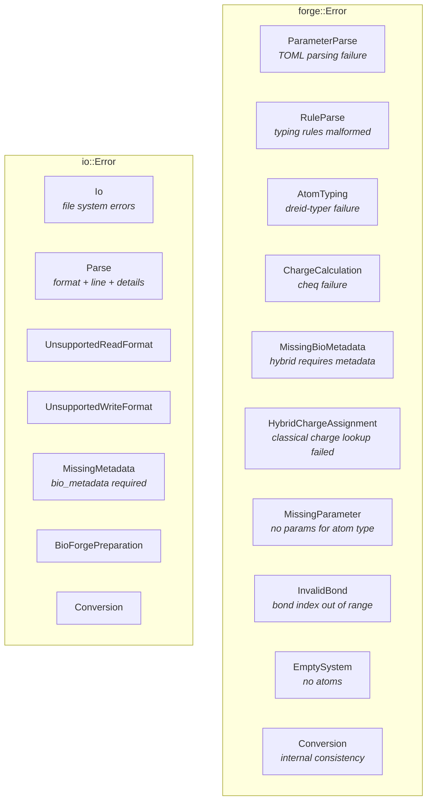

### 6.2 Error Propagation

- **Eager validation:** Bond indices are checked immediately in `IntermediateSystem::from_system`
- **Typed errors:** Each error variant carries context (atom type, line number, format)
- **thiserror integration:** All errors implement `std::error::Error` with proper `Display`
- **No panics:** Library functions return `Result` types; panics only occur for internal bugs

---

## 7. Configuration Reference

### 7.1 ForgeConfig

```rust
pub struct ForgeConfig {
    pub rules: Option<String>,        // Custom typing rules (TOML)
    pub params: Option<String>,       // Custom FF params (TOML)
    pub charge_method: ChargeMethod,  // None, Qeq, or Hybrid
    pub bond_potential: BondPotentialType,   // Harmonic or Morse
    pub angle_potential: AnglePotentialType, // ThetaHarmonic or CosineHarmonic
    pub vdw_potential: VdwPotentialType,     // LennardJones or Exponential6
}
```

### 7.2 Potential Type Selection

| Config Field      | Options                           | DREIDING Default |
| ----------------- | --------------------------------- | ---------------- |
| `bond_potential`  | `Harmonic`, `Morse`               | `Harmonic`       |
| `angle_potential` | `ThetaHarmonic`, `CosineHarmonic` | `ThetaHarmonic`  |
| `vdw_potential`   | `LennardJones`, `Exponential6`    | `LennardJones`   |

### 7.3 Charge Method Configuration

```rust
pub enum ChargeMethod {
    None,              // All charges = 0.0
    Qeq(QeqConfig),    // Global QEq for all atoms
    Hybrid(HybridConfig), // Classical + QEq (requires BioMetadata)
}
```

### 7.4 QeqConfig

```rust
pub struct QeqConfig {
    pub total_charge: f64,       // Target system charge (default: 0.0)
    pub solver_options: SolverOptions,
}
```

### 7.5 HybridConfig

```rust
pub struct HybridConfig {
    pub protein_scheme: ProteinScheme,   // AMBER ff99SB/ff14SB/ff19SB, AMBER ff03, CHARMM C22/C27/C36/C36m
    pub nucleic_scheme: NucleicScheme,   // AMBER OL15/OL21/OL24/bsc1/OL3, CHARMM C27/C36
    pub water_scheme: WaterScheme,       // TIP3P, TIP3P-FB, SPC, SPC/E, OPC3
    pub ligand_configs: Vec<LigandChargeConfig>, // Per-ligand QEq configuration
    pub default_ligand_qeq: QeqConfig,   // Default QEq for unlisted ligands
}
```

### 7.6 Ligand Charge Configuration

```rust
pub struct LigandChargeConfig {
    pub selector: ResidueSelector,  // Target residue (chain_id, residue_id, insertion_code)
    pub method: LigandQeqMethod,    // Vacuum or Embedded QEq
}

pub enum LigandQeqMethod {
    Vacuum(QeqConfig),        // Isolated QEq calculation
    Embedded(EmbeddedQeqConfig), // QEq polarized by environment
}

pub struct EmbeddedQeqConfig {
    pub cutoff_radius: f64,   // Environment search radius in Å (default: 10.0)
    pub qeq: QeqConfig,       // QEq solver settings
}
```

### 7.7 Residue Selector

```rust
pub struct ResidueSelector {
    pub chain_id: String,
    pub residue_id: i32,
    pub insertion_code: Option<char>,  // None matches any insertion code
}
```

### 7.8 I/O Configurations

| Config              | Purpose                            |
| ------------------- | ---------------------------------- |
| `CleanConfig`       | Control water/ion/hydrogen removal |
| `ProtonationConfig` | pH, histidine strategy             |
| `SolvateConfig`     | Water box margin, ion types        |
| `TopologyConfig`    | Hetero templates, disulfide cutoff |
| `LammpsConfig`      | Cutoffs, boundary conditions       |

---

## 8. Dependency Architecture

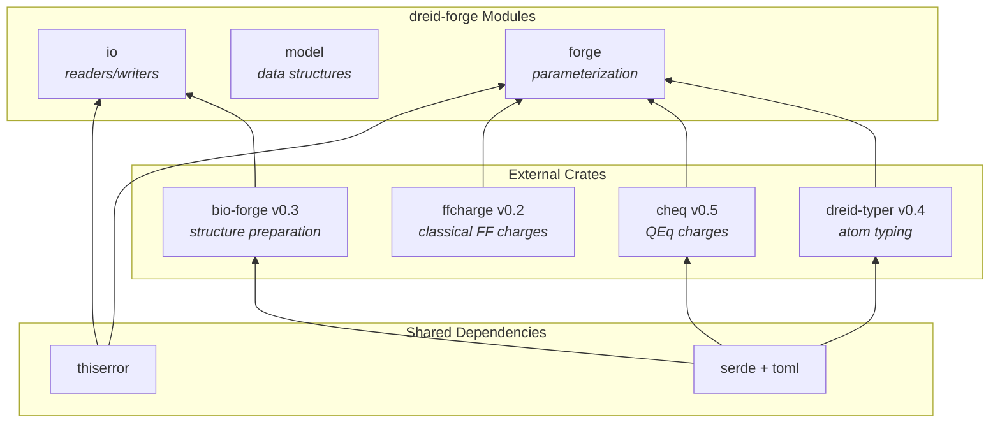

### Integration Points

| Crate         | Version | Integration Module                            | Key Types Exchanged                                          |
| ------------- | ------- | --------------------------------------------- | ------------------------------------------------------------ |
| `bio-forge`   | 0.3     | `io::util`, `io::pdb`, `io::mmcif`            | `Structure`, `Topology`, `Template`                          |
| `dreid-typer` | 0.4     | `forge::typer`                                | `MolecularGraph`, `MolecularTopology`, `Hybridization`       |
| `cheq`        | 0.5     | `forge::charge::qeq`, `forge::charge::hybrid` | `QEqSolver`, `ExternalPotential`, `PointCharge`              |
| `ffcharge`    | 0.2     | `forge::charge::hybrid`                       | `ProteinScheme`, `NucleicScheme`, `WaterScheme`, `IonScheme` |

---

## 9. Performance Considerations

### 9.1 Computational Complexity

| Stage                | Complexity            | Dominant Operation         |
| -------------------- | --------------------- | -------------------------- |
| System conversion    | O(A + B)              | Neighbor list construction |
| Ring detection       | O(B × R)              | SSSR enumeration           |
| Aromaticity          | O(R)                  | π-electron counting        |
| Typing               | O(A × Rules × Rounds) | Rule matching              |
| QEq                  | O(A³)                 | Matrix solve               |
| Parameter generation | O(B + Ang + Dih)      | Term enumeration           |

Where A = atoms, B = bonds, R = rings.

### 9.2 Memory Layout

- **IntermediateSystem:** Owned data, heap-allocated vectors
- **ForgedSystem:** Clones input System, owns all generated parameters
- **Potentials:** Flat vectors with no internal pointers

### 9.3 Parallelization Opportunities

- **cheq:** Coulomb matrix construction is parallelized via `rayon`
- **dreid-typer:** Perception passes are sequential but O(A)
- **Parameter generation:** Each potential type can be generated independently
