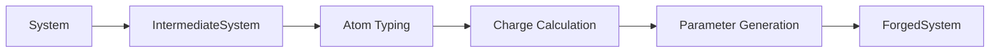

# DREID-Forge

**DREID-Forge** is a high-performance, pure-Rust library for automated DREIDING force field parameterization. It orchestrates atom typing, partial charge calculation, and potential energy function generation to produce simulation-ready inputs for both biological macromolecules and arbitrary chemical systems—all without leaving the Rust type system.

## Highlights

- **Automated atom typing** — assigns DREIDING atom types (e.g., `C_3`, `O_R`, `N_2`) based on element, hybridization, and local bonding environment via the `dreid-typer` crate.
- **QEq charge equilibration** — computes electronegativity-equalized partial atomic charges using the `cheq` library, with configurable total charge constraints.
- **Comprehensive potential generation** — produces bond (harmonic/Morse), angle (theta-harmonic/cosine-harmonic), dihedral, improper, van der Waals (LJ 12-6/Exp-6), and hydrogen bond potentials.
- **Format interoperability** — reads PDB, mmCIF, MOL2, and SDF structures with optional biomolecular preparation (cleaning, protonation, solvation); exports to BGF and complete LAMMPS simulation packages.
- **Rust-first ergonomics** — no FFI, no global mutable state, edition 2024, and a carefully designed public API with comprehensive RustDoc documentation.

## Parameterization Pipeline at a Glance



1. **Convert** — `IntermediateSystem::from_system` builds neighbor lists and prepares bonds for physical order assignment.
2. **Type** — `assign_atom_types` delegates to `dreid-typer` to assign DREIDING atom types and enumerate angles, dihedrals, and impropers.
3. **Charge** — `assign_charges` optionally computes QEq partial charges via `cheq`.
4. **Generate** — `generate_parameters` produces all bonded and non-bonded potential parameters according to DREIDING rules.
5. **Output** — The resulting `ForgedSystem` is ready for export to BGF or LAMMPS formats.

## Quick Start

Add `dreid-forge` to your `Cargo.toml`:

```toml
[dependencies]
dreid-forge = "0.2.0"
```

### Example: Parameterizing a Molecule

```rust
use dreid_forge::{Atom, Bond, BondOrder, Element, System};
use dreid_forge::{forge, ForgeConfig, ChargeMethod, QeqConfig, ForgeError};

fn main() -> Result<(), ForgeError> {
    // Build a water molecule
    let mut system = System::new();
    system.atoms.push(Atom::new(Element::O, [0.0, 0.0, 0.0]));
    system.atoms.push(Atom::new(Element::H, [0.9575, 0.0, 0.0]));
    system.atoms.push(Atom::new(Element::H, [-0.2399, 0.9272, 0.0]));
    system.bonds.push(Bond::new(0, 1, BondOrder::Single));
    system.bonds.push(Bond::new(0, 2, BondOrder::Single));

    // Parameterize with QEq charges
    let config = ForgeConfig {
        charge_method: ChargeMethod::Qeq(QeqConfig::default()),
        ..Default::default()
    };
    let forged = forge(&system, &config)?;

    // Inspect results
    println!("Atom types: {:?}", forged.atom_types);
    println!("Bonds: {}", forged.potentials.bonds.len());
    println!("Angles: {}", forged.potentials.angles.len());

    // Oxygen should be negatively charged, hydrogens positive
    assert!(forged.atom_properties[0].charge < 0.0);
    assert!(forged.atom_properties[1].charge > 0.0);

    Ok(())
}
```

### Example: Reading PDB and Writing LAMMPS

```rust
use std::fs::File;
use std::io::{BufReader, BufWriter};

use dreid_forge::{forge, ForgeConfig};
use dreid_forge::io::{
    BioReader, Format, CleanConfig, ProtonationConfig,
    write_lammps_package, LammpsConfig,
};

fn main() -> Result<(), Box<dyn std::error::Error>> {
    // Read and prepare a PDB structure
    let file = File::open("protein.pdb")?;
    let system = BioReader::new(BufReader::new(file), Format::Pdb)
        .clean(CleanConfig { remove_water: true, remove_ions: true, ..Default::default() })
        .protonate(ProtonationConfig::default())
        .read()?;

    // Parameterize with DREIDING force field
    let forged = forge(&system, &ForgeConfig::default())?;

    // Write LAMMPS data and settings files
    let mut data = BufWriter::new(File::create("system.data")?);
    let mut settings = BufWriter::new(File::create("system.in.settings")?);
    write_lammps_package(&mut data, &mut settings, &forged, &LammpsConfig::default())?;

    Ok(())
}
```

> **Tip**: For small molecules without biological context, use `ChemReader` with MOL2 or SDF formats instead.

For detailed usage instructions and configuration options, refer to the [API Documentation](https://docs.rs/dreid-forge).

## Documentation

- [API Documentation](https://docs.rs/dreid-forge) — comprehensive reference for all public types and functions.
- [Architecture Overview](ARCHITECTURE.md) — detailed explanation of the internal design, algorithms, and data flow.

## Dependencies

`dreid-forge` builds on several specialized crates:

| Crate                                                 | Purpose                                                                         |
| ----------------------------------------------------- | ------------------------------------------------------------------------------- |
| [`dreid-typer`](https://crates.io/crates/dreid-typer) | DREIDING atom type assignment and topology enumeration                          |
| [`cheq`](https://crates.io/crates/cheq)               | Charge equilibration (QEq) solver                                               |
| [`bio-forge`](https://crates.io/crates/bio-forge)     | Biomolecular structure preparation (cleaning, protonation, solvation, topology) |

## License

This project is licensed under the MIT License — see the [LICENSE](LICENSE) file for details.
