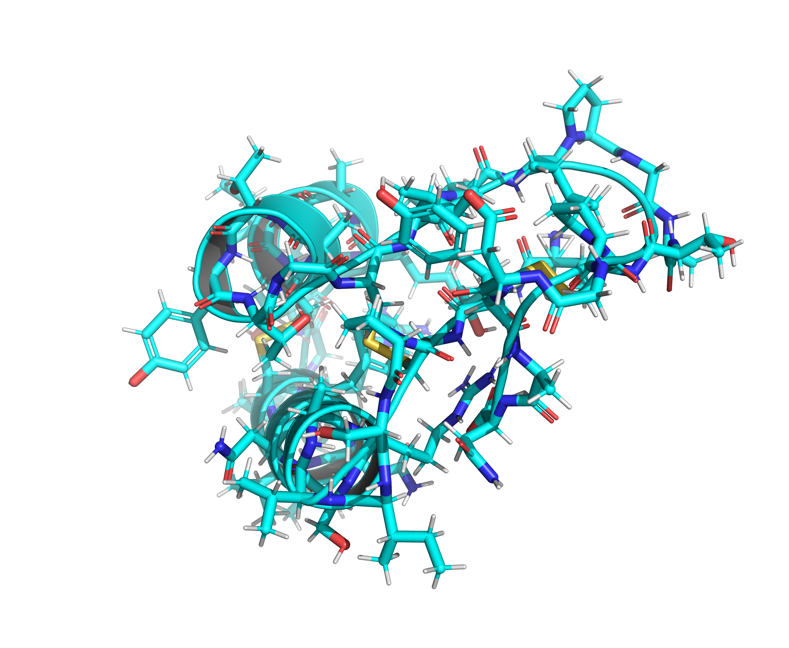

# Simple Chemistry & Biomolecule Examples

## Benzene (C6H6) Molecule (Chemistry)


### Inputs

- **Structure**: `BNZ.sdf` — SDF file of a benzene molecule.

### Commands

```bash
dforge chem -i BNZ.sdf -o BNZ.data # LAMMPS data file

dforge chem -i BNZ.sdf -o BNZ.data -o BNZ.settings # LAMMPS data + settings files

dforge chem -i BNZ.sdf -o BNZ.mol2 # MOL2 file
```

### Outputs

- **LAMMPS Data File**: `BNZ.data` — Contains atomic coordinates, types, bonds, angles, dihedrals, and impropers.
- **LAMMPS Settings File**: `BNZ.settings` — Contains force field parameters for LAMMPS simulations.
- **MOL2 File**: `BNZ.mol2` — Contains molecular structure with atom and bond information.

## Crambin Protein (Biomolecule)



### Inputs

- **Structure**: `1CRN.pdb` — Crambin crystal structure.

### Commands

```bash
dforge bio -i 1CRN.pdb -o 1CRN.data # LAMMPS data file

dforge bio -i 1CRN.pdb -o 1CRN.data -o 1CRN.settings # LAMMPS data + settings files

dforge bio -i 1CRN.pdb -o 1CRN.bgf # BGF file

dforge bio -i 1CRN.pdb -o 1CRN.cif # MMCIF file

dforge bio -i 1CRN.pdb -o 1CRN.sdf # SDF file
```

### Outputs

- **LAMMPS Data File**: `1CRN.data` — Contains atomic coordinates, types, bonds, angles, dihedrals, and impropers.
- **LAMMPS Settings File**: `1CRN.settings` — Contains force field parameters for LAMMPS simulations.
- **BGF File**: `1CRN.bgf` — Contains biomolecular structure with atom types and connectivity.
- **mmCIF File**: `1CRN.cif` — Contains crystallographic information for the biomolecule.
- **SDF File**: `1CRN.sdf` — Contains molecular structure with atom and bond information.
