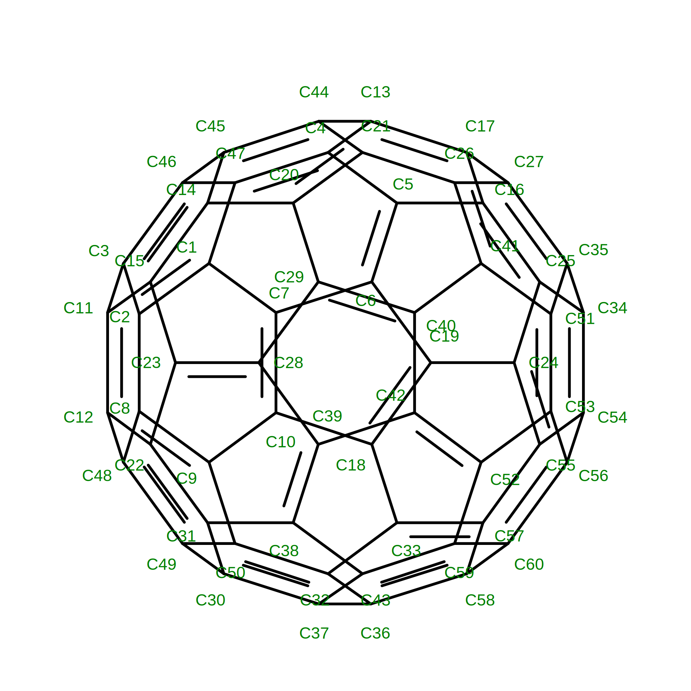

# Complex Molecular Systems Examples

## 5HKR — Fullerene-Protein Complex

| Structure                                      | Template                                     |
| ---------------------------------------------- | -------------------------------------------- |
|  |  |

### Inputs

- **Structure**: `5HKR.pdb` — Crystal structure of de novo designed fullerene organising protein complex with fullerene (C60).
- **Template**: `C60.mol2` — MOL2 file of a C60 fullerene molecule.

### Commands

```bash
dforge bio -i 5HKR.pdb -o 5HKR.bgf --template C60.mol2 # BGF file with fullerene template
```

### Outputs

- **BGF File**: `5HKR.bgf` — Contains biomolecular structure with atom types and connectivity, including fullerene.

## 3L1P — DNA-Protein Complex


### Inputs

- **Structure**: `3L1P.pdb` — Crystal structure of a DNA-protein complex (transcription factor bound to DNA).

### Commands

```bash
dforge bio -i 3L1P.pdb -o 3L1P.bgf # BGF file of DNA-protein complex
```

### Outputs

- **BGF File**: `3L1P.bgf` — Contains biomolecular structure with atom types and connectivity for both DNA and protein components.
