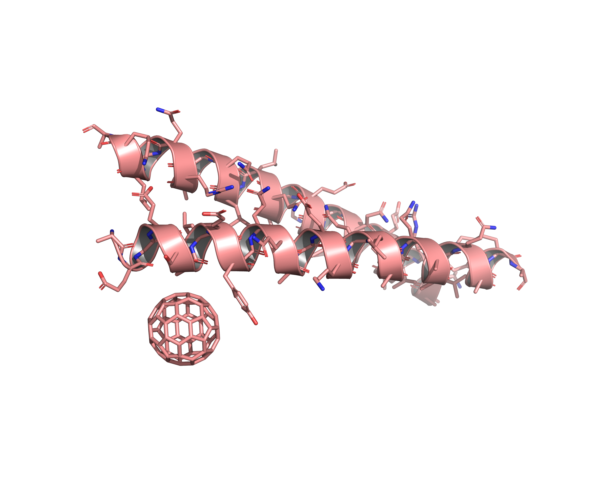
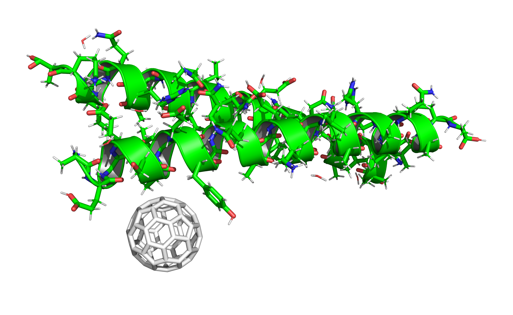
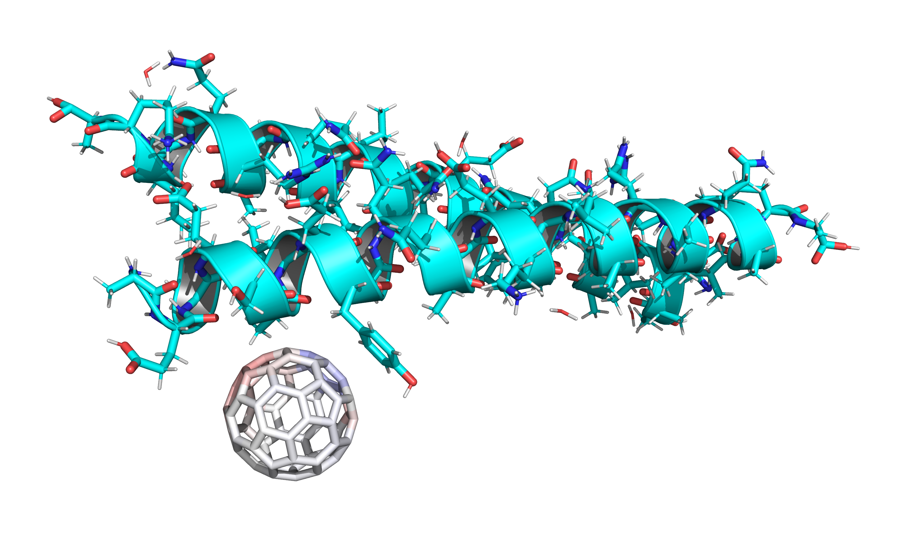
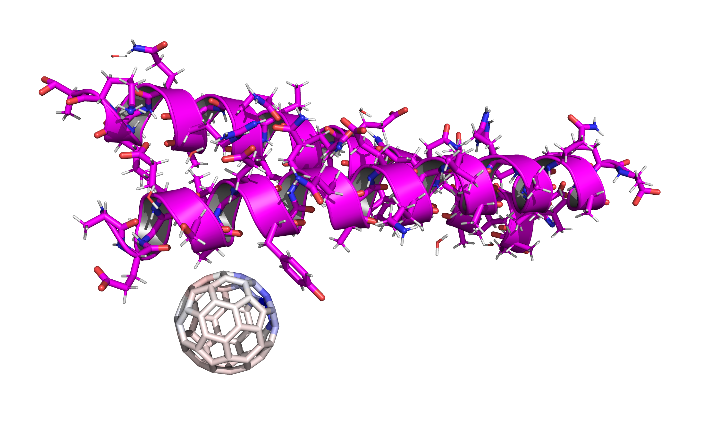
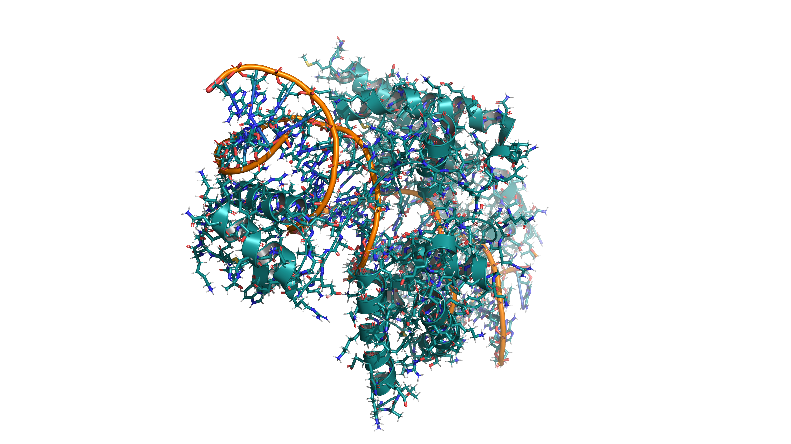

# Complex Molecular Systems Examples

## 5HKR — Fullerene-Protein Complex



### Inputs

- **Structure**: `5HKR.pdb` — Crystal structure of de novo designed fullerene organising protein complex with fullerene (C60).
- **Template**: `C60.mol2` — MOL2 file of a C60 fullerene molecule.

### Commands

```bash
# Basic parameterization (no charges)
dforge bio -i 5HKR.pdb -o 5HKR.bgf --template C60.mol2

# Global QEq charges for all atoms
dforge bio -i 5HKR.pdb -o 5HKR-qeq.bgf --template C60.mol2 --charge qeq

# Hybrid charges: AMBER for protein, embedded QEq for C60 (default pH is physiological)
dforge bio -i 5HKR.pdb -o 5HKR-hybrid.bgf --template C60.mol2 --charge hybrid

# Hybrid charges at different pH conditions
dforge bio -i 5HKR.pdb -o 5HKR-hybrid-ph2.bgf --template C60.mol2 --charge hybrid --ph 2.0
dforge bio -i 5HKR.pdb -o 5HKR-hybrid-ph9.bgf --template C60.mol2 --charge hybrid --ph 9.0

# Hybrid charges with vacuum QEq (no environmental polarization)
dforge bio -i 5HKR.pdb -o 5HKR-vacuum.bgf --template C60.mol2 --charge hybrid --default-ligand-method vacuum
```

### Outputs

- **BGF File**: `5HKR.bgf` — Contains biomolecular structure with DREIDING atom types and connectivity, including the fullerene. All charges are zero.
- **BGF File with QEq Charges**: `5HKR-qeq.bgf` — Contains biomolecular structure with global QEq charges assigned to all atoms.
- **BGF File with Hybrid Charges**: `5HKR-hybrid.bgf` — Contains biomolecular structure with AMBER charges for the protein and embedded QEq charges for the fullerene, polarized by the protein's electrostatic field.
- **BGF Files at Different pH**: `5HKR-hybrid-ph2.bgf` and `5HKR-hybrid-ph9.bgf` — Similar to above but with protonation states adjusted for pH 2.0 and pH 9.0, respectively.
- **BGF File with Vacuum QEq**: `5HKR-vacuum.bgf` — Contains biomolecular structure with AMBER charges for the protein and vacuum QEq charges for the fullerene, without environmental polarization.

### C60 Charge Distribution Analysis

The following table compares C60 charge distributions under different calculation methods:

| Method                             | Image                                                    | Description                                                                                                                                                                                                                                                                                                               |
| :--------------------------------- | :------------------------------------------------------- | :------------------------------------------------------------------------------------------------------------------------------------------------------------------------------------------------------------------------------------------------------------------------------------------------------------------------ |
| **No Polarization** (vacuum QEq)   |  | **Symmetric State**: C60 is treated as an isolated molecule. Due to its perfect icosahedral symmetry ($I_h$ point group), all carbon atoms maintain **zero charge** (±0.0001 e).                                                                                                                                          |
| **Low pH** (pH 2.0, embedded QEq)  |             | **Weak Positive Induction**: At pH 2.0, Tyr9 exists in its neutral phenol form. Its aromatic $\pi$-system and the surrounding positive protein field induce a moderate positive charge on nearby C60 atoms (e.g., C34: **+0.039 e**).                                                                                     |
| **High pH** (pH 9.0, embedded QEq) |           | **Enhanced Positive Polarization**: As pH increases, Tyr9 begins to deprotonate toward its anionic form (Tyrosinate). The resulting negative oxygen center exerts a strong repulsive force on C60’s electron cloud, driving the nearby carbon atoms to a **significantly more positive state** (e.g., C34: **+0.049 e**). |

## 3L1P — DNA-Protein Complex



### Inputs

- **Structure**: `3L1P.pdb` — Crystal structure of a DNA-protein complex (transcription factor bound to DNA).

### Commands

```bash
dforge bio -i 3L1P.pdb -o 3L1P.bgf # BGF file of DNA-protein complex
```

### Outputs

- **BGF File**: `3L1P.bgf` — Contains biomolecular structure with atom types and connectivity for both DNA and protein components.
