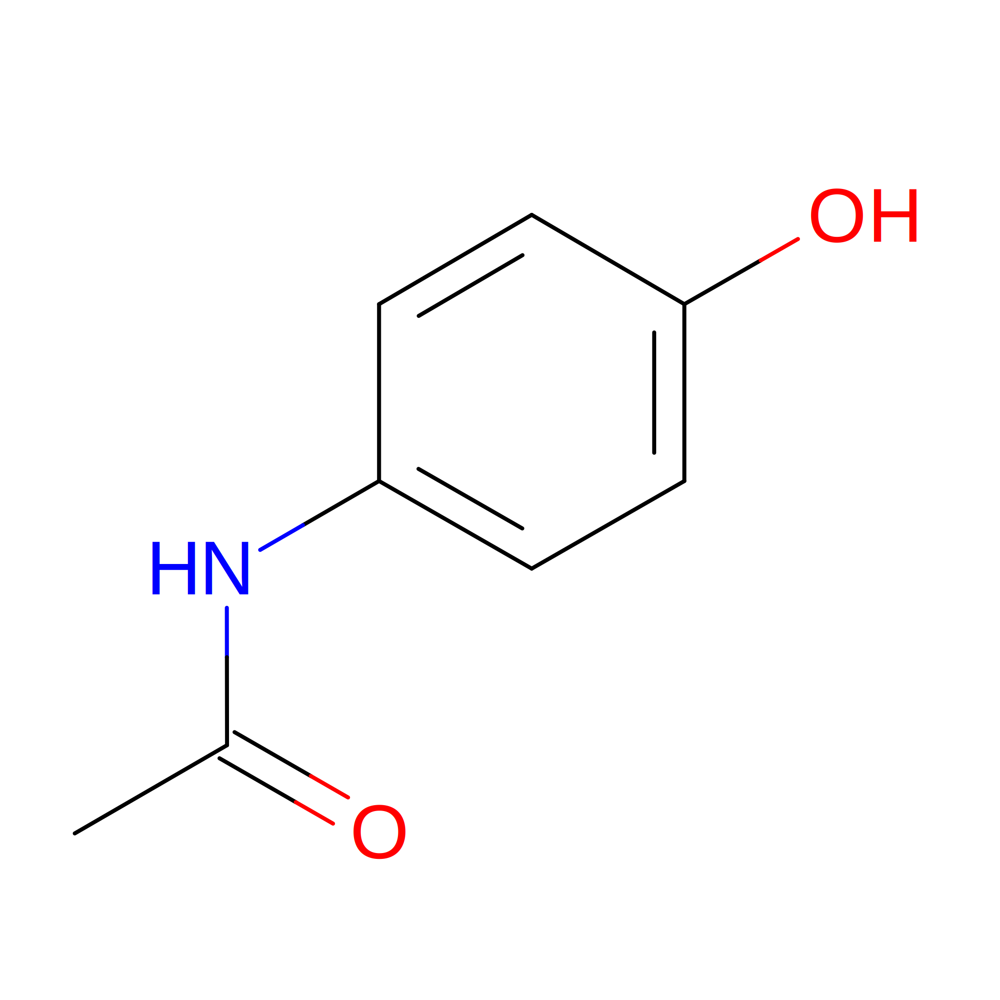
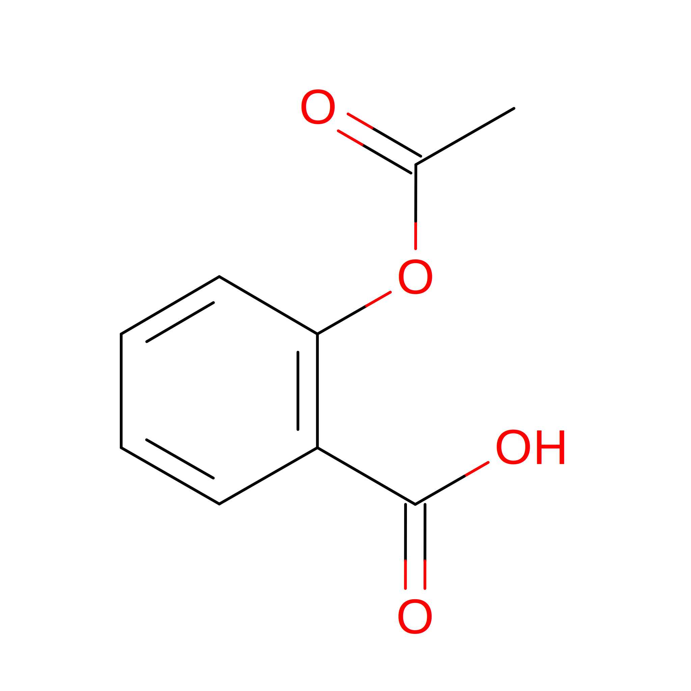
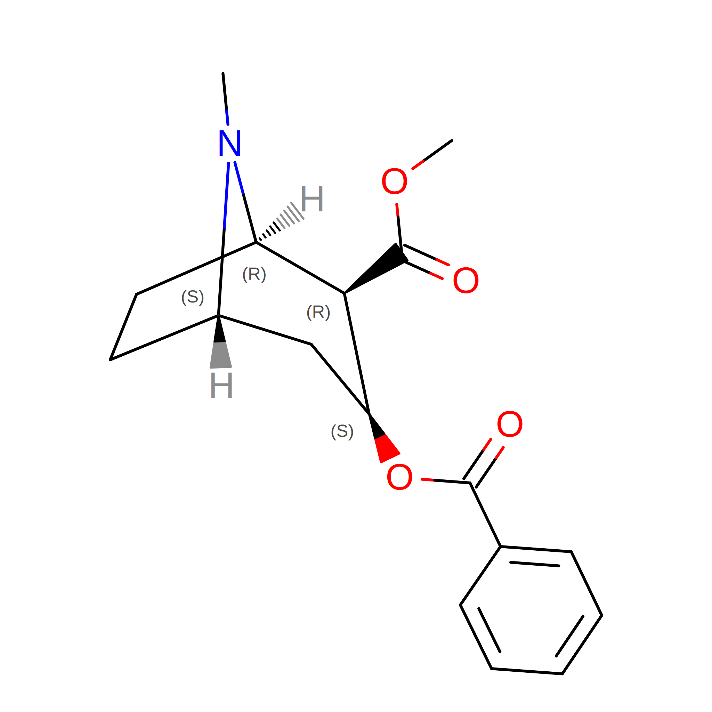
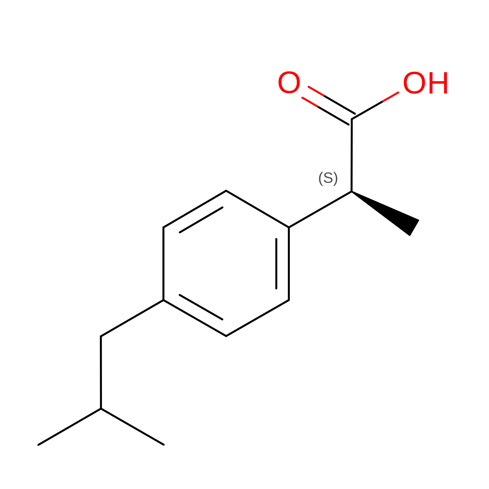
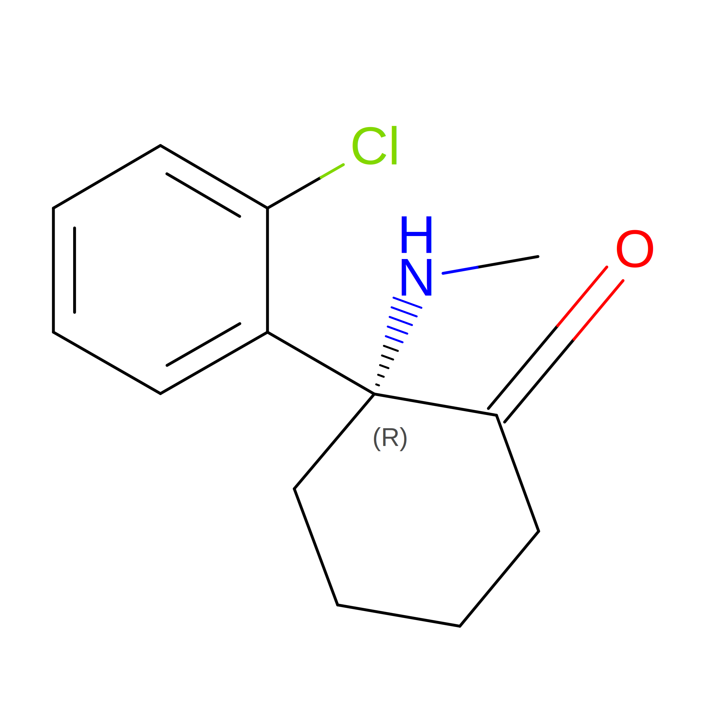
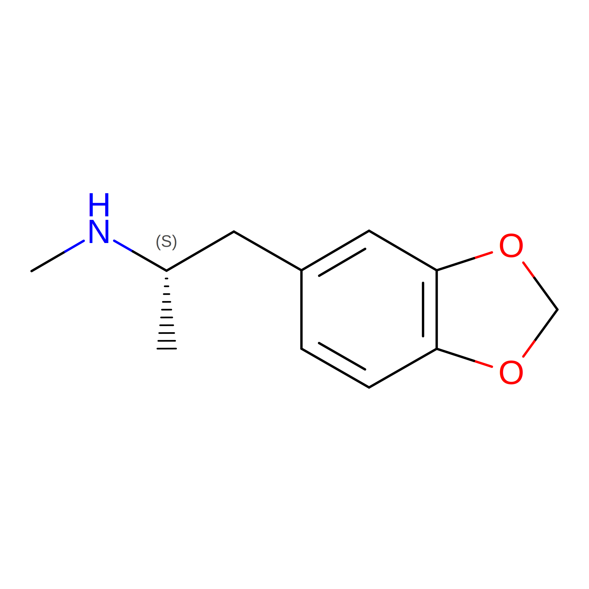
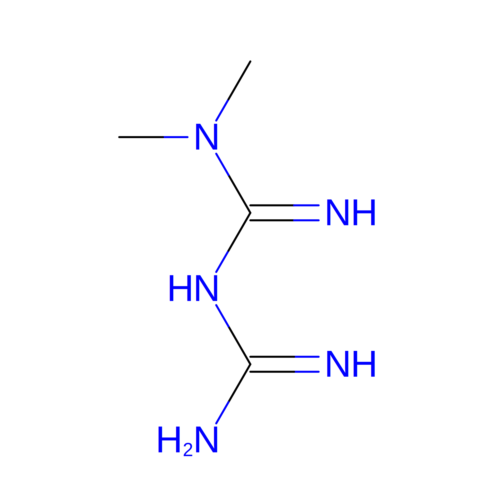
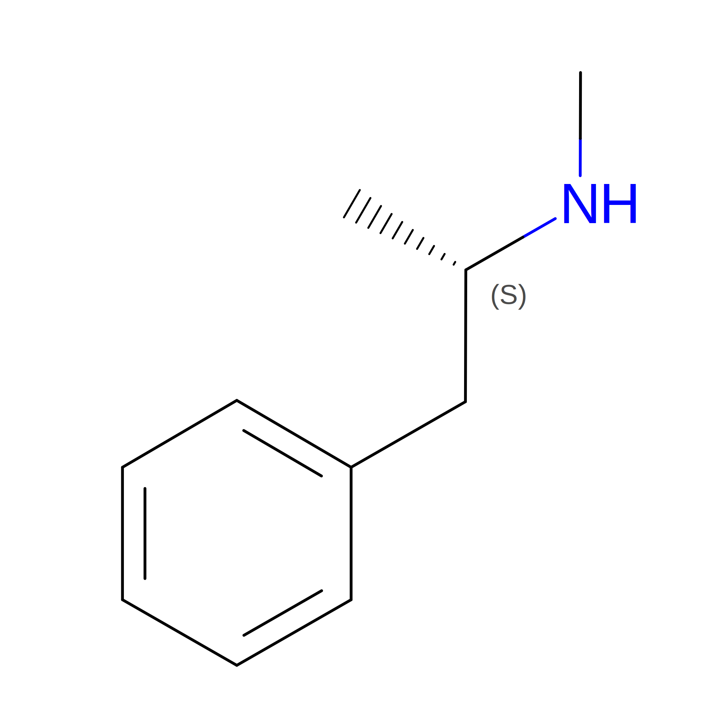
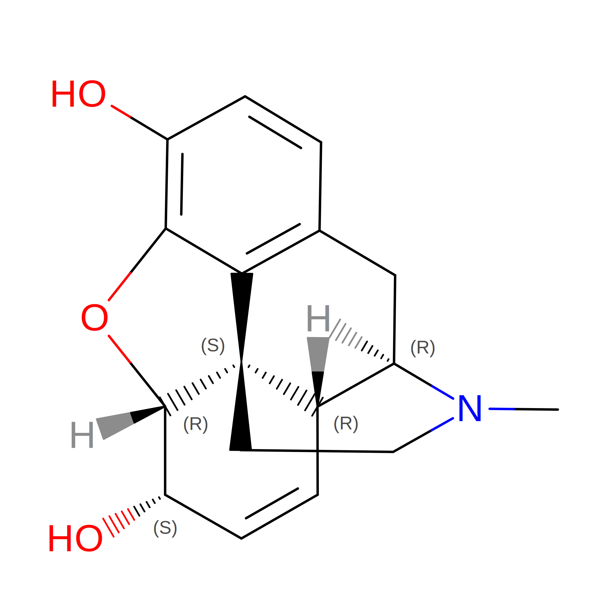
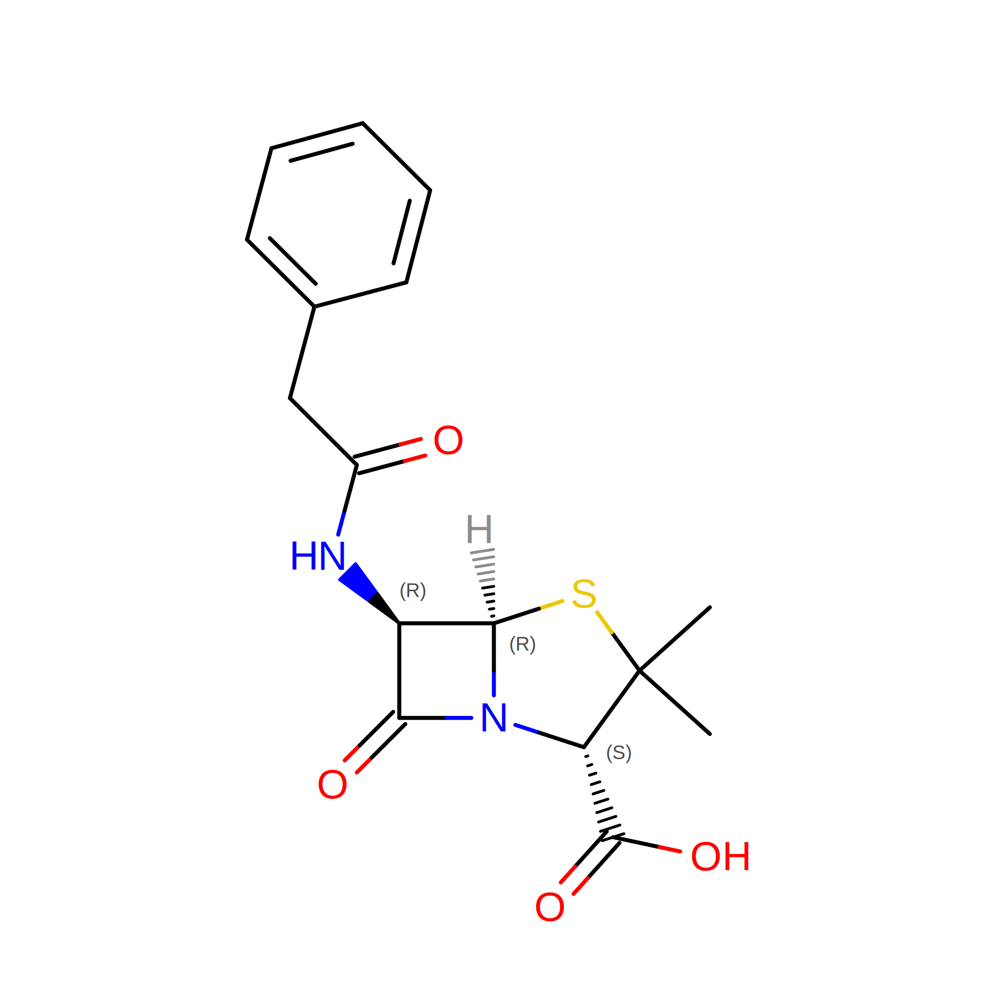

# Drugs (Small Molecules) Examples

## Acetaminophen (Pain Reliever)



### Inputs

- **Structure**: `Acetaminophen.sdf` — SDF file of an acetaminophen molecule.

### Commands

```bash
dforge chem -i Acetaminophen.sdf -o Acetaminophen.data -o Acetaminophen.settings # LAMMPS data + settings files
```

### Outputs

- **LAMMPS Data File**: `Acetaminophen.data` — Contains atomic coordinates, types, bonds, angles, dihedrals, and impropers.
- **LAMMPS Settings File**: `Acetaminophen.settings` — Contains force field parameters for LAMMPS simulations.

## Aspirin (Pain Reliever)



### Inputs

- **Structure**: `Aspirin.sdf` — SDF file of an aspirin molecule.

### Commands

```bash
dforge chem -i Aspirin.sdf -o Aspirin.data -o Aspirin.settings # LAMMPS data + settings files
```

### Outputs

- **LAMMPS Data File**: `Aspirin.data` — Contains atomic coordinates, types, bonds, angles, dihedrals, and impropers.
- **LAMMPS Settings File**: `Aspirin.settings` — Contains force field parameters for LAMMPS simulations.

## Cocaine (Stimulant Drug)



### Inputs

- **Structure**: `Cocaine.sdf` — SDF file of a cocaine molecule.

### Commands

```bash
dforge chem -i Cocaine.sdf -o Cocaine.data -o Cocaine.settings # LAMMPS data + settings files
```

### Outputs

- **LAMMPS Data File**: `Cocaine.data` — Contains atomic coordinates, types, bonds, angles, dihedrals, and impropers.
- **LAMMPS Settings File**: `Cocaine.settings` — Contains force field parameters for LAMMPS simulations.

## Ibuprofen (Nonsteroidal Anti-Inflammatory Drug)



### Inputs

- **Structure**: `Ibuprofen.sdf` — SDF file of an ibuprofen molecule.

### Commands

```bash
dforge chem -i Ibuprofen.sdf -o Ibuprofen.data -o Ibuprofen.settings # LAMMPS data + settings files
```

### Outputs

- **LAMMPS Data File**: `Ibuprofen.data` — Contains atomic coordinates, types, bonds, angles, dihedrals, and impropers.
- **LAMMPS Settings File**: `Ibuprofen.settings` — Contains force field parameters for LAMMPS simulations.

## Ketamine (Dissociative Anesthetic)



### Inputs

- **Structure**: `Ketamine.sdf` — SDF file of a ketamine molecule.

### Commands

```bash
dforge chem -i Ketamine.sdf -o Ketamine.data -o Ketamine.settings # LAMMPS data + settings files
```

### Outputs

- **LAMMPS Data File**: `Ketamine.data` — Contains atomic coordinates, types, bonds, angles, dihedrals, and impropers.
- **LAMMPS Settings File**: `Ketamine.settings` — Contains force field parameters for LAMMPS simulations.

## MDMA (Psychoactive Drug)



### Inputs

- **Structure**: `MDMA.sdf` — SDF file of an MDMA molecule.

### Commands

```bash
dforge chem -i MDMA.sdf -o MDMA.data -o MDMA.settings # LAMMPS data + settings files
```

### Outputs

- **LAMMPS Data File**: `MDMA.data` — Contains atomic coordinates, types, bonds, angles, dihedrals, and impropers.
- **LAMMPS Settings File**: `MDMA.settings` — Contains force field parameters for LAMMPS simulations.

## Metformin (Diabetes Medication)



### Inputs

- **Structure**: `Metformin.sdf` — SDF file of a metformin molecule.

### Commands

```bash
dforge chem -i Metformin.sdf -o Metformin.data -o Metformin.settings # LAMMPS data + settings files
```

### Outputs

- **LAMMPS Data File**: `Metformin.data` — Contains atomic coordinates, types, bonds, angles, dihedrals, and impropers.
- **LAMMPS Settings File**: `Metformin.settings` — Contains force field parameters for LAMMPS simulations.

## Methamphetamine (Stimulant Drug)



### Inputs

- **Structure**: `Methamphetamine.sdf` — SDF file of a methamphetamine molecule.

### Commands

```bash
dforge chem -i Methamphetamine.sdf -o Methamphetamine.data -o Methamphetamine.settings # LAMMPS data + settings files
```

### Outputs

- **LAMMPS Data File**: `Methamphetamine.data` — Contains atomic coordinates, types, bonds, angles, dihedrals, and impropers.
- **LAMMPS Settings File**: `Methamphetamine.settings` — Contains force field parameters for LAMMPS simulations.

## Morphine (Opioid Pain Reliever)



### Inputs

- **Structure**: `Morphine.sdf` — SDF file of a morphine molecule.

### Commands

```bash
dforge chem -i Morphine.sdf -o Morphine.data -o Morphine.settings # LAMMPS data + settings files
```

### Outputs

- **LAMMPS Data File**: `Morphine.data` — Contains atomic coordinates, types, bonds, angles, dihedrals, and impropers.
- **LAMMPS Settings File**: `Morphine.settings` — Contains force field parameters for LAMMPS simulations.

## Penicillin-G (Antibiotic)



### Inputs

- **Structure**: `Penicillin-G.sdf` — SDF file of a penicillin-G molecule.

### Commands

```bash
dforge chem -i Penicillin-G.sdf -o Penicillin-G.data -o Penicillin-G.settings # LAMMPS data + settings files
```

### Outputs

- **LAMMPS Data File**: `Penicillin-G.data` — Contains atomic coordinates, types, bonds, angles, dihedrals, and impropers.
- **LAMMPS Settings File**: `Penicillin-G.settings` — Contains force field parameters for LAMMPS simulations.
