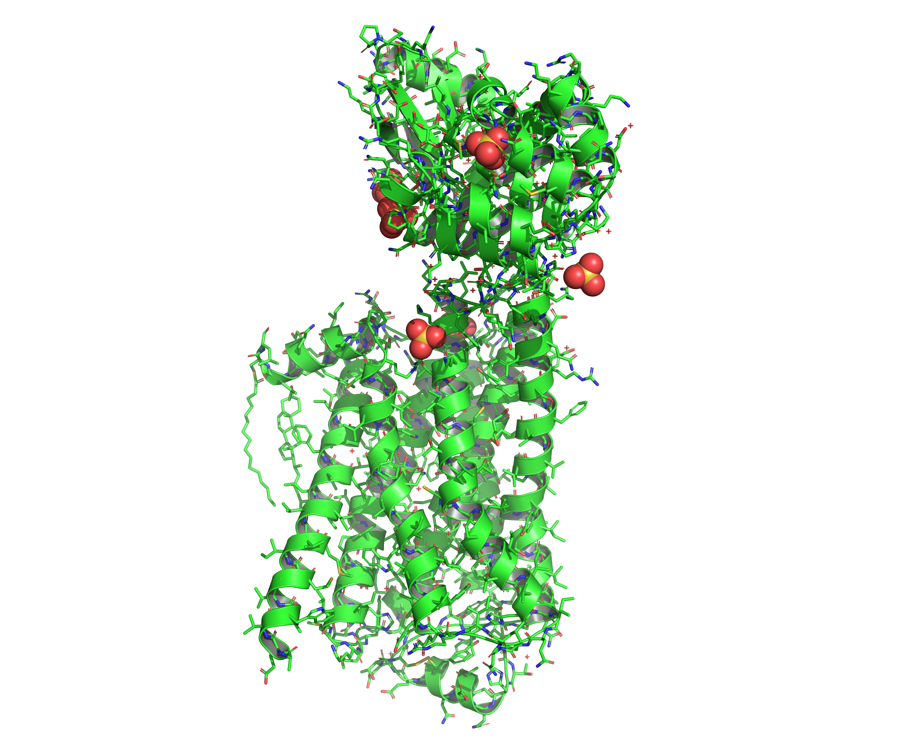
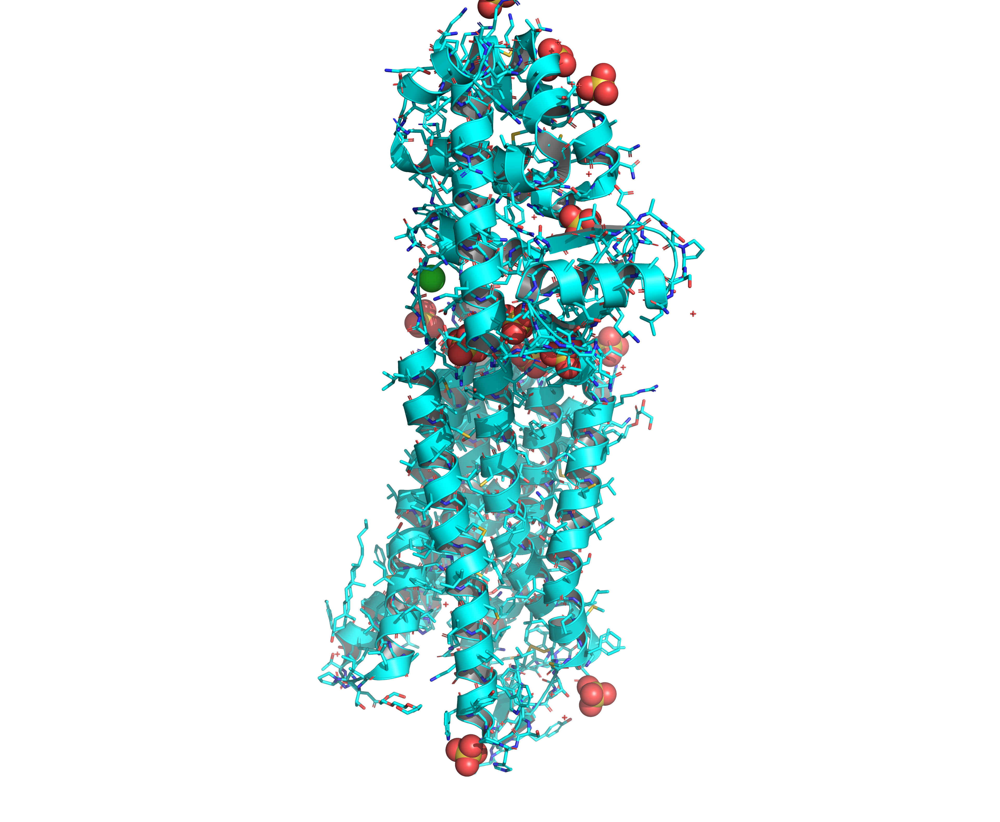
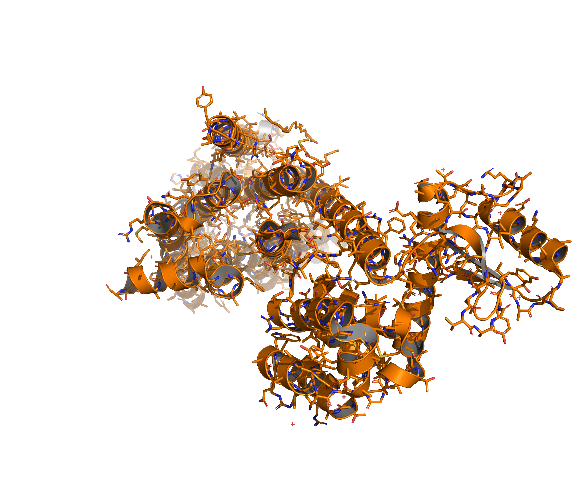

# Large Molecule Examples

## 2RH1 — Human B2-Adrenergic G Protein-Coupled Receptor



### Inputs

- **Structure**: `2RH1.pdb` — High resolution crystal structure of human B2-adrenergic G protein-coupled receptor.

### Commands

```bash
dforge bio -i 2RH1.pdb -o 2RH1.bgf --no-hetero # BGF file (cleaned)
```

### Outputs

- **BGF File**: `2RH1.bgf` — Contains biomolecular structure with atom types and connectivity, excluding heteroatoms.

## 4DKL — Mouse Optic G Protein-Coupled Receptor



### Inputs

- **Structure**: `4DKL.pdb` — Crystal structure of the mu-opioid receptor bound to a morphinan antagonist.

### Commands

```bash
dforge bio -i 4DKL.pdb -o 4DKL.bgf --no-hetero # BGF file (cleaned)
```

### Outputs

- **BGF File**: `4DKL.bgf` — Contains biomolecular structure with atom types and connectivity, excluding heteroatoms.

## 6CM4 — Human D2 Dopamine Receptor



### Inputs

- **Structure**: `6CM4.pdb` — Structure of the D2 Dopamine Receptor Bound to the Atypical Antipsychotic Drug Risperidone.

### Commands

```bash
dforge bio -i 6CM4.pdb -o 6CM4.bgf --no-hetero # BGF file (cleaned)
```

### Outputs

- **BGF File**: `6CM4.bgf` — Contains biomolecular structure with atom types and connectivity, excluding heteroatoms.
